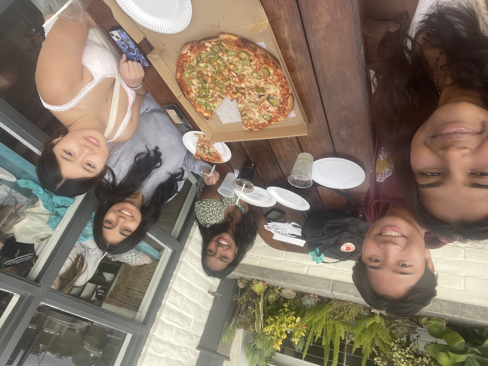

# Student Blog

## Tara Sehdave

## Shay and I

## My friends and I

## About Me
Hi, my name is Tara and I am a junior this year, taking AP CSP. I am intersted in this class since computer science is activeley becoming a more integrated part of society and it is important to stay updated. I love hanging out with my friends and going to the beach. I play guitar and love listening to music, especially Queen and Lana Del Rey. My favorite food is anything Indian or Japanese and my favorite subject is history, especially world history.

| Class       | Period 
| ----------- |:-------|
| AP CSP      |   1      |
| AP EL        |   2      |
| AP CALC      |   3      |
| AP PHYS C.     |   4      |
| AP USH   |   5      |